# SprayCraft: Graph-Based Route Optimization for Variable Rate Precision Spraying

<div align="center">

[](https://arxiv.org/abs/2412.12176)
[](https://kirankkethineni.github.io/SprayCraft/)
[](LICENSE)
[](https://python.org)

**[Project Page](https://kirankkethineni.github.io/SprayCraft/) | [Paper (arXiv)](https://arxiv.org/abs/2412.12176) | [Notebook](SprayCraft.ipynb)**

*Kiran K. Kethineni, Saraju P. Mohanty, Elias Kougianos, Sanjukta Bhowmick, Laavanya Rachakonda*
University of North Texas &nbsp;|&nbsp; University of North Carolina Wilmington

</div>

---

## Overview

<div align="center">
  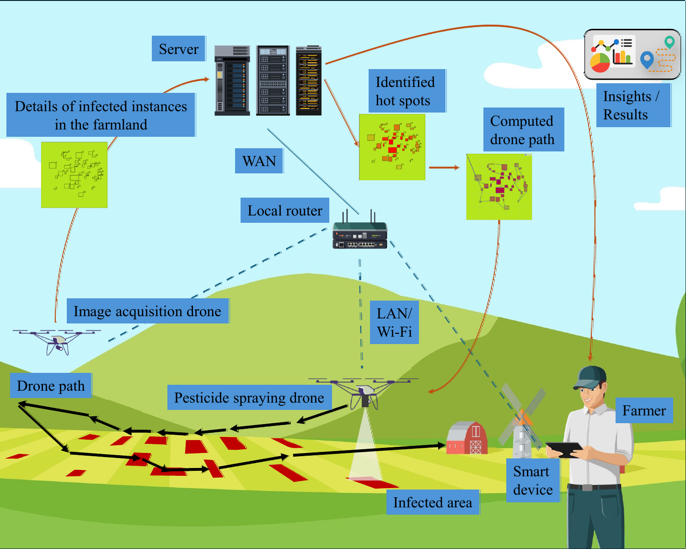
</div>

Plant diseases cause up to **20% of global produce loss**. Yet conventional spraying treats every part of a field identically — wasting pesticide, damaging ecosystems, and promoting resistance — even though disease is never uniformly distributed. It clusters. It spreads from hotspots.

**SprayCraft** is an Agriculture Cyber-Physical System (A-CPS) that treats the diseased field as a spatial graph and solves three intertwined problems simultaneously:

| Question | Why it's hard |
|---|---|
| **Where to spray?** | Disease clusters spatially near infection sources — hotspots must be identified from spatial relationships, not just individual instances |
| **How much to spray?** | Dosage must be proportional to infection intensity, which requires estimating spread probability, not just presence |
| **How to get there?** | The drone must visit all diseased locations efficiently — this is the Traveling Salesman Problem, and doing it naively wastes battery and time |

Classical approaches treat these independently or ignore the spatial structure entirely. SprayCraft is the **first unified graph-theoretic framework** that answers all three at once.

---

## System Architecture

<div align="center">
  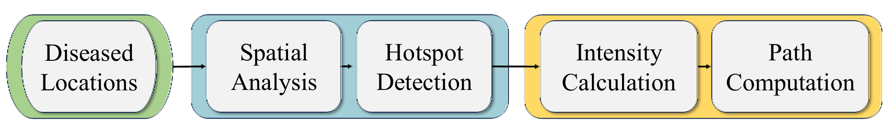
</div>

SprayCraft operates as a two-stage pipeline: **Stage 1** detects where disease is most dangerous using graph message passing; **Stage 2** computes the drone route and adapts spray dosage to what Stage 1 found.

---

## Stage 1 — Hotspot Detection via Graph Message Passing

<div align="center">
  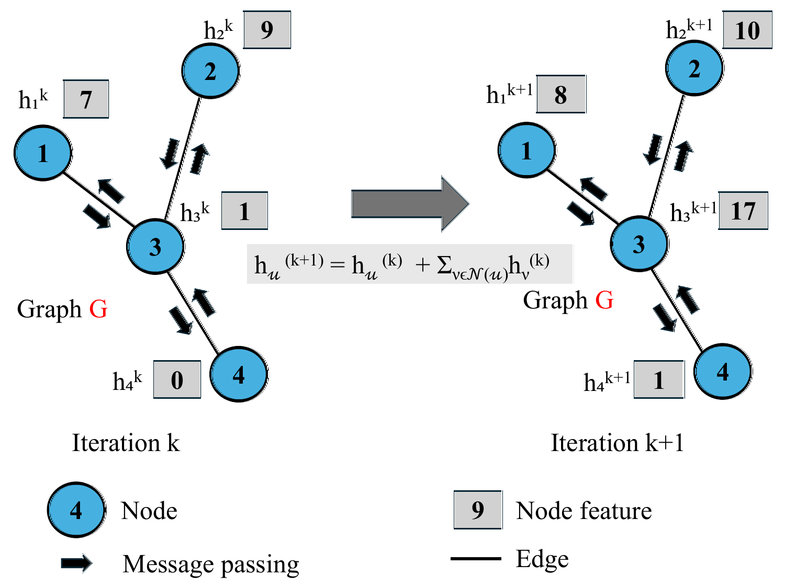
</div>

Each diseased instance detected in the field (from a crop disease classifier) becomes a **node** in a spatial graph. Nodes that fall within a distance threshold — determined by the pathogen's natural dispersal radius — are connected by **edges** weighted by inverse distance. Closer nodes exert stronger influence on each other.

```
Graph G = (V, E, F)
  V : diseased locations (one node per detection)
  E : edges between nodes within dispersal radius
  W(u,v) : edge weight = distance between u and v
  F : node feature = bounding box area of diseased instance
```

**Message passing** then runs iteratively. At each step, every node aggregates the features of its neighbors, weighted by how close they are:

```
h_u^(k+1) = UPDATE( h_u^(k),  AGG( { h_v^(k) · 1/W(u,v) : v ∈ N(u) } ) )
```

After convergence, nodes that sit at the center of dense, heavily-infected clusters accumulate much higher feature values than isolated nodes. These are the **hotspots** — the locations most likely to spread infection to the rest of the field.

Normalizing the final feature values produces a **hotspot probability score** per node:

```
p_u = h_u / max(h)    ∈ [0, 1]
```

This score directly drives variable spray dosage in Stage 2.

<div align="center">
  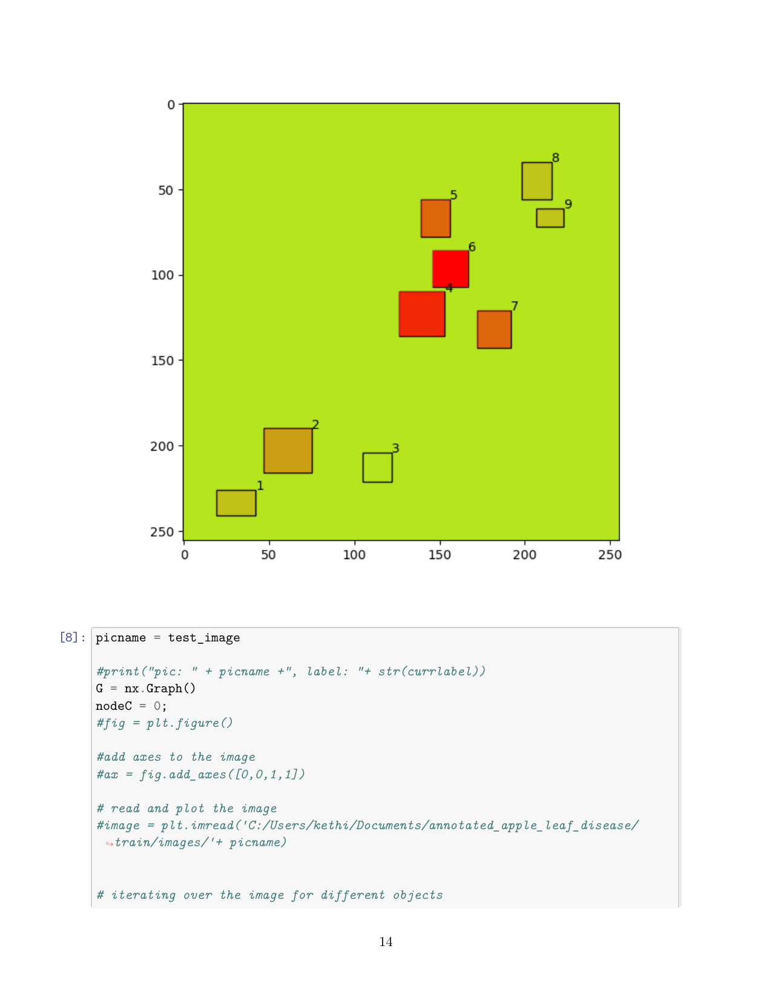
  <br/><em>Hotspot probability scores across the field after message passing. Nodes 14 and 15 are flagged as primary hotspots.</em>
</div>

<div align="center">
  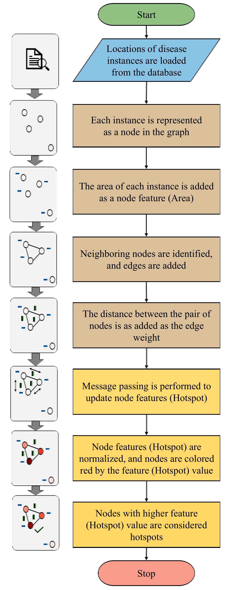
  <br/><em>Feature evolution across message passing iterations — hotspot nodes diverge upward as they accumulate neighbor signals.</em>
</div>

---

## Stage 2a — Near-Optimal Route via Christofides TSP

<div align="center">
  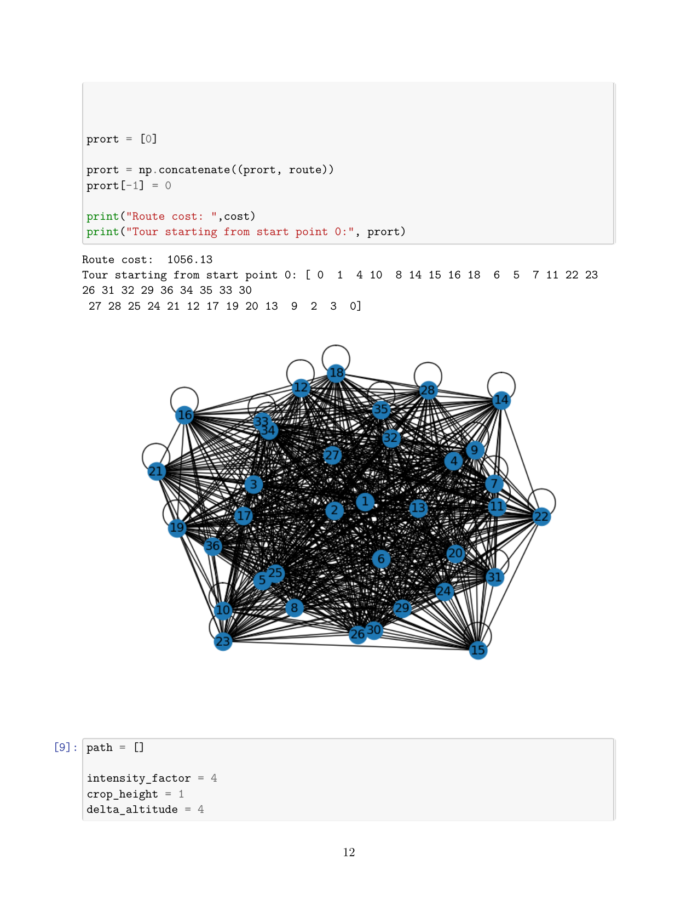
  <br/><em>Near-optimal Hamiltonian circuit through all 36 diseased locations, produced by the Christofides algorithm.</em>
</div>

Visiting all diseased locations is the **Traveling Salesman Problem** — NP-hard to solve exactly. SprayCraft uses the **Christofides algorithm**, which guarantees a tour within **1.5× of optimal** while running in polynomial time:

1. Compute **Minimum Spanning Tree (MST)** of the location graph
2. Find all **odd-degree nodes** in the MST
3. Compute **minimum-weight perfect matching** on those nodes
4. Combine MST + matching into an **Eulerian circuit**
5. Shortcut repeated nodes to produce a **Hamiltonian circuit**

On the test field of 36 locations, this produced a tour of **1,056.13 meters** — traversing the sequence `[0→1→4→10→8→14→15→16→18→...→0]`, naturally clustering spatially adjacent nodes together.

---

## Stage 2b — Boustrophedon Coverage Paths

<div align="center">
  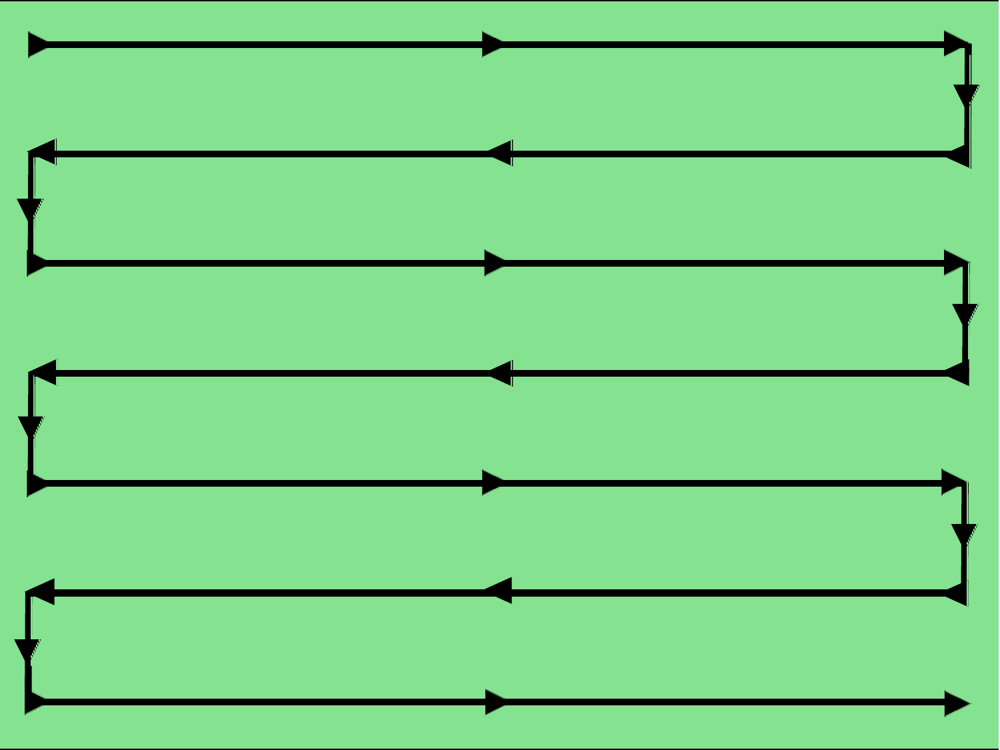
  <br/><em>Serpentine (boustrophedon) coverage path at a diseased location. Parallel sweeps with spacing = 2× spray radius ensure 100% coverage with no gaps or overlaps.</em>
</div>

At each stop on the TSP tour, the drone doesn't just fly over a single point — it executes a **boustrophedon (serpentine) coverage path** to treat the entire diseased area. Parallel sweeps are spaced at exactly twice the spray radius so coverage is complete with no redundant overlap.

The spray radius at each location is derived from that node's hotspot probability score, which also controls how the drone adapts to the available hardware:

### Variable Rate Sprayer (`VRS_BuiltIn = True`)
For drones with PWM/PID flow control, hotspot probability directly modulates the flow rate. The drone flies at constant altitude; the nozzle delivers more pesticide over hotspots and less over peripheral areas.

```python
spray_radius = 2 - 1 × hotspot_probability   # tighter radius at hotspots
flow_rate    ∝ hotspot_probability            # higher dose at hotspots
altitude     = constant
```

### Constant Rate Sprayer (`VRS_BuiltIn = False`)
For drones with a fixed flow rate, the effective coverage area is controlled by **adjusting flight altitude**. Flying lower concentrates the spray cone; flying higher disperses it. At hotspots, the drone descends for denser application.

```python
Area     = π × R²
R        = f(altitude, cone_angle)
altitude = g(hotspot_probability)             # lower altitude at hotspots
```

<div align="center">
  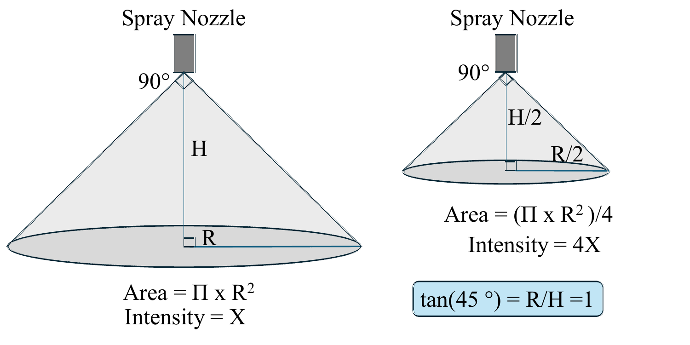
  <br/><em>Conical spray geometry. For constant-rate sprayers, flight altitude determines the effective coverage radius on the ground.</em>
</div>

---

## Full Flight Path

<div align="center">
  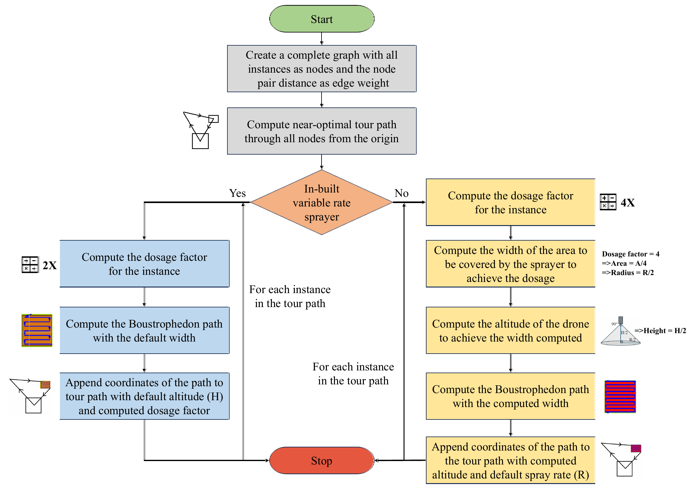
</div>

<div align="center">
  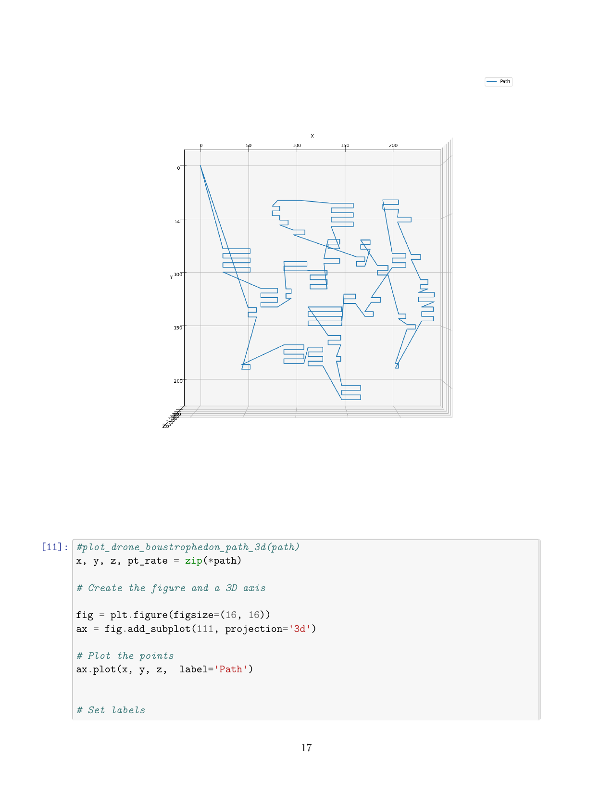
  <br/><em>3D visualization of the complete drone flight path. Altitude varies continuously as the drone moves between locations — rising over low-risk areas and descending to concentrate spray at hotspots (constant-rate mode shown).</em>
</div>

<div align="center">
  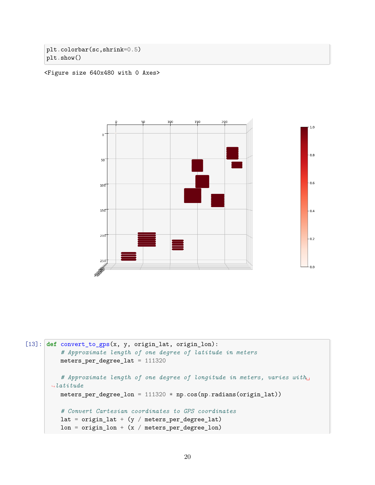
  <br/><em>Variable-rate spray heat map overlaid on the field. Warm colors indicate higher pesticide concentration, concentrated at the disease hotspots identified by message passing.</em>
</div>

---

## Results

Evaluated on a synthetic farmland with **36 diseased locations** in a 250×250 m area using apple leaf disease annotations (Black Rot, Cedar Apple Rust, Apple Scab).

| Metric | Value |
|---|---|
| Detected hotspot nodes | **Nodes 14 and 15** (highest aggregated features after message passing) |
| TSP tour length | **1,056.13 m** through 36 locations |
| Total boustrophedon path | **~3,254.7 m** |
| Flight altitude range (constant sprayer) | **3.0 m – 4.8 m** |
| Spray radius range (variable sprayer) | **1.0 m – 2.0 m** |
| TSP approximation guarantee | **≤ 1.5× optimal** |

### Comparison with Related Work

| Approach | Spatial Analysis | Hotspot Detection | Variable Rate | Route Optimization |
|---|---|---|---|---|
| Traditional Uniform Spraying | None | None | Fixed | None |
| Grid-based Coverage | Grid only | None | Fixed | Boustrophedon only |
| ML Disease Severity (no routing) | Local only | Per-image | Limited | None |
| **SprayCraft (Ours)** | **Graph spatial** | **Message passing** | **Probabilistic** | **TSP + Boustrophedon** |

---

## Installation & Usage

```bash
# 1. Clone the repository
git clone https://github.com/kirankkethineni/SprayCraft.git
cd SprayCraft

# 2. Install dependencies
pip install pandas matplotlib networkx numpy tensorflow jupyter

# 3. Launch the notebook
jupyter notebook SprayCraft.ipynb
```

Run cells in order. The key parameters to configure before execution:

```python
intensity_factor = 4        # Spray intensity scaling factor
crop_height      = 1        # Crop height in meters
delta_altitude   = 4        # Base drone altitude above crop top
VRS_BuiltIn      = True     # True  = variable-rate sprayer (PWM/PID flow control)
                            # False = constant-rate sprayer (altitude controls dosage)
```

### Notebook Structure

| Section | What it does |
|---|---|
| Data Loading | Loads annotated apple leaf disease dataset; parses bounding boxes and class labels |
| Graph Construction | Builds spatial graph — nodes = disease instances, edges = proximity within dispersal radius |
| Message Passing | Runs iterative aggregation; computes and normalizes hotspot probability scores |
| Route Optimization | Computes MST → applies Christofides algorithm → outputs TSP tour |
| Boustrophedon Paths | Generates serpentine coverage paths per location; adapts spacing to hotspot scores |
| Variable Rate Logic | Modulates flow rate (VRS) or altitude (constant rate) using hotspot probability |
| GPS Conversion | Converts meter-based waypoints to GPS lat/long via Haversine formula |
| Visualization | Renders 3D flight altitude maps, spray heat maps, and path overlays |

---

## Citation

```bibtex
@article{kethineni2024spraycraft,
  title   = {SprayCraft: Graph-Based Route Optimization for Variable Rate Precision Spraying},
  author  = {Kethineni, Kiran K. and Mohanty, Saraju P. and Kougianos, Elias
             and Bhowmick, Sanjukta and Rachakonda, Laavanya},
  journal = {arXiv preprint arXiv:2412.12176},
  year    = {2024},
  url     = {https://arxiv.org/abs/2412.12176}
}
```

---

## Authors

| Author | Affiliation |
|---|---|
| Kiran K. Kethineni | University of North Texas |
| Saraju P. Mohanty | University of North Texas |
| Elias Kougianos | University of North Texas |
| Sanjukta Bhowmick | University of North Texas |
| Laavanya Rachakonda | University of North Carolina Wilmington |

---

<div align="center">
  <a href="https://kirankkethineni.github.io/SprayCraft/">Project Page</a> &nbsp;|&nbsp;
  <a href="https://arxiv.org/abs/2412.12176">Paper</a> &nbsp;|&nbsp;
  <a href="SprayCraft.ipynb">Code Notebook</a>
</div>
